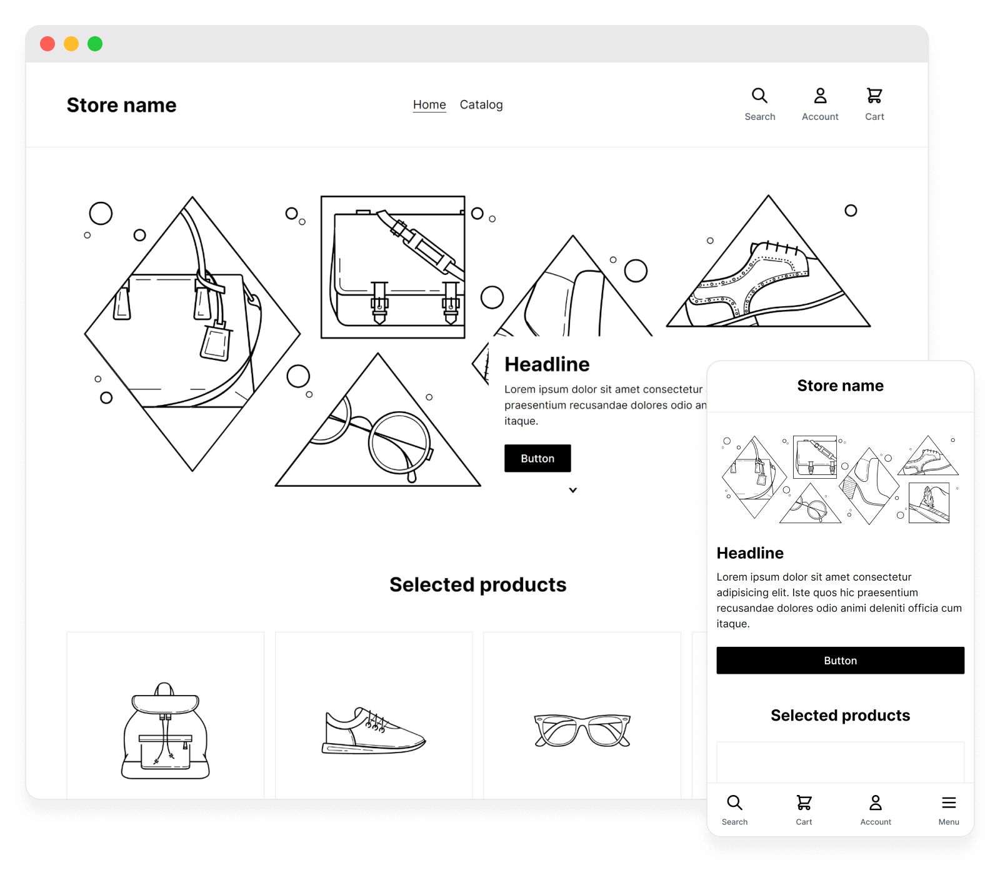

<!-- logo (start) -->

  

  

<!-- logo (end) -->

<!-- title / description (start) -->
<h2 align="center">Shopify Foundation Theme</h2>

Shopify Foundation Theme is modern Shopify theme built with [Shopify Theme Lab](https://github.com/uicrooks/shopify-theme-lab/tree/legacy-v3), [Vue](https://v3.vuejs.org) and [Tailwind CSS](https://tailwindcss.com).
<!-- title / description (end) -->

<!-- preview (start) -->

<!-- preview (end) -->

<!-- features (start) -->
## Features

- All [Shopify Theme Lab](https://github.com/uicrooks/shopify-theme-lab/tree/legacy-v3#features) features
- Starter Theme ready for customization
- Clean structure
- Vue.js
- Tailwind CSS
- Responsive
- Image lazy-loading
<!-- features (end) -->

<!-- docs (start) -->
## Docs

Everything from the [Shopify Theme Lab docs](https://github.com/uicrooks/shopify-theme-lab/tree/legacy-v3) applies to this project, since it was built with Shopify Theme Lab.
<!-- docs (end) -->